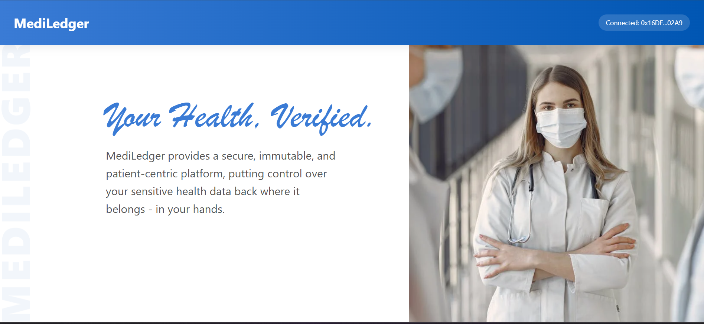
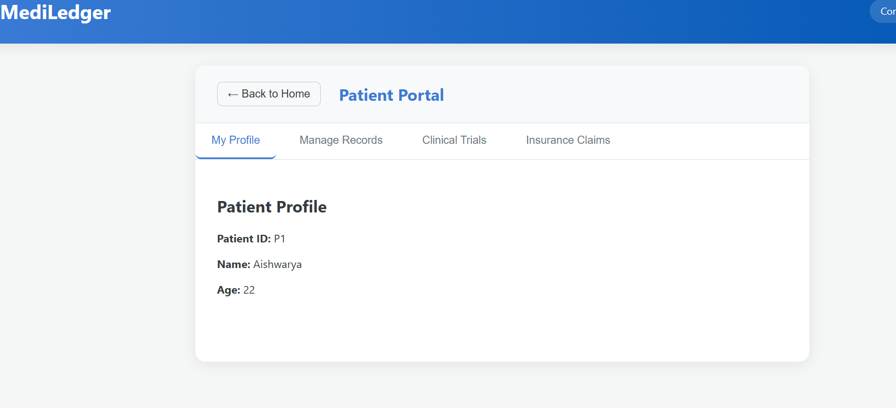
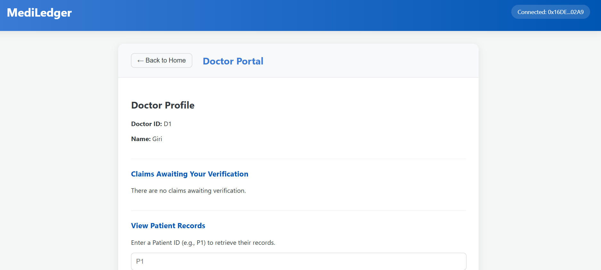
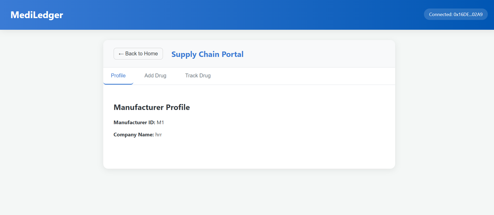
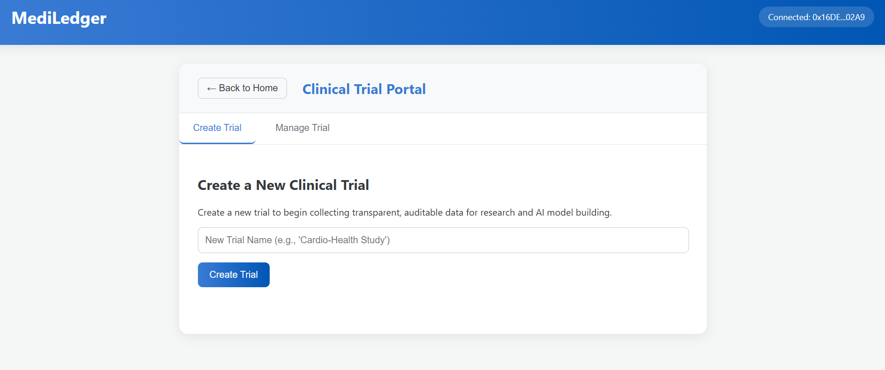

# 🏥 MediLedger  

**Tagline:** *Secure. Immutable. Yours.*  

---

## 🩸 Overview  

**MediLedger** is a comprehensive **decentralized application (DApp)** built on the **Ethereum blockchain** that revolutionizes healthcare data management.  

It provides a **secure, transparent, and patient-centric platform** for managing:  
- Electronic Health Records (EHR)  
- Pharmaceutical Supply Chain  
- Clinical Trials  
- Insurance Claims  

MediLedger puts **control back into the hands of patients, doctors, manufacturers, and insurers** through blockchain transparency.

---

## 🖼️ Application Preview  

MediLedger features a **clean, modern, and multi-portal interface** for different user roles, starting with a central dashboard:

(./assets/LP1.png)  

### 👤 Patient Portal  
  

### 🩺 Doctor Portal  
  

### 💊 Supply Chain Portal  
  

### 🔬 Clinical Trial Portal  
  

### 📄 Insurance Claim Portal  
  

---

## ✨ Core Features  

### 👤 Patient Portal  
- **Decentralized Identity:** Register securely using an Ethereum wallet and receive a unique Patient ID (e.g., `P1`).  
- **Record Management:** Upload and view immutable medical records on the blockchain.  
- **Access Control:** Grant or revoke access to doctors using their Doctor ID (e.g., `D1`).  
- **Service Interaction:** Participate in clinical trials and submit insurance claims directly.  

---

### 🩺 Doctor Portal  
- **Professional Registration:** Register as a verified healthcare provider (e.g., `D1`).  
- **Secure Record Access:** View patient records only with granted permission.  
- **Claim Verification:** Review and verify insurance claims from patients.  

---

### 💊 Drug Supply Chain Portal  
- **Manufacturer Registration:** Register pharmaceutical companies and receive a Manufacturer ID.  
- **Drug Tokenization:** Represent drug batches as blockchain tokens for authenticity.  
- **Track & Trace:** Update and track drug status to prevent counterfeiting.  

---

### 🔬 Clinical Trial Portal  
- **Trial Creation:** Research organizations can log trials on-chain.  
- **Tamper-Proof Data:** Store anonymized trial data hashes immutably.  
- **Patient Consent:** Patients securely opt in to participate in trials.  

---

### 📄 Insurance Claim Portal  
- **Seamless Submission:** File claims directly from the patient dashboard.  
- **Multi-Party Verification:** Claims verified by both doctors and insurers.  
- **Transparent Tracking:** Track claim progress through immutable blockchain records.  

---

## 🛠️ Technology Stack  

| Component | Technology |
|------------|-------------|
| **Blockchain** | Solidity, Truffle Suite, Ganache |
| **Front-End** | React.js, Ethers.js, JavaScript (ES6+), CSS3 |
| **Wallet & Authentication** | MetaMask |

---
## 🌐 Live Demo  

Access the deployed web app here:  
👉 **[MediLedger Live App](https://your-health-verified-git-main-aishwarya-sreejiths-projects.vercel.app/)**  

---

### 🚀 How to Use the Live Demo  

To interact with the live deployed application, you will need to configure your MetaMask wallet to use the **Sepolia Testnet**.  

1. **Install MetaMask:** Add the MetaMask extension to your browser.  
2. **Switch to Sepolia:** Open MetaMask → click the network dropdown → select **"Sepolia"** test network.  
3. **Get Free Test ETH:** You’ll need some test ETH (gas) to make transactions. Visit:  
   - [https://sepoliafaucet.com](https://sepoliafaucet.com)  
   - [https://infura.io/faucet/sepolia](https://infura.io/faucet/sepolia)  
4. **Use the App:** With your wallet connected to Sepolia and funded with test ETH, you can now use all features — register as a patient, add records, manage claims, etc.  

---

## ⚙️ Setup and Installation  

Follow these steps to set up MediLedger on your local system:  

### ✅ Prerequisites  
Ensure you have the following installed:  
- **Node.js** (v14 or higher)  
- **Truffle Suite**  
  ```bash
  npm install -g truffle
## ⚙️ Prerequisites

- **Ganache** (for local blockchain simulation)
- **MetaMask** (browser extension for wallet connection)

---

## 🧩 Steps to Run Locally

### 1️⃣ Clone the Repository
```bash
git clone https://github.com/AishRev/MediLedger--Your-Health-Verified.git
cd MediLedger--Your-Health-Verified
## 2️⃣ Install Dependencies
```bash
npm install
```
---
## 3️⃣ Start Ganache
Open **Ganache GUI** or run a local blockchain instance.

Note the **RPC Server** (e.g., `HTTP://127.0.0.1:7545`) and **Network ID**.

---

## 4️⃣ Compile and Migrate Smart Contracts
```bash
truffle compile
truffle migrate --reset
```

---

## 5️⃣ Start the Frontend
```bash
npm run dev
```

If using React, open: **http://localhost:5173**

---

## 6️⃣ Connect MetaMask
- Add the **local blockchain network** (from Ganache).  
- Import **test accounts** using private keys from Ganache.  

---

## 7️⃣ Access the App
- Launch the app in your browser.  
- Choose your user role (**Patient**, **Doctor**, **Manufacturer**, etc.).  
- Interact with the blockchain features.  

---

## 📜 License
This project is licensed under the terms of the **MIT License**.

---

## 🧠 Author
**👩‍💻 Aishwarya Sreejith**  
🔗 **GitHub:** [@AishRev](https://github.com/AishRev)  
📦 **Project:** *MediLedger – Your Health, Verified*

