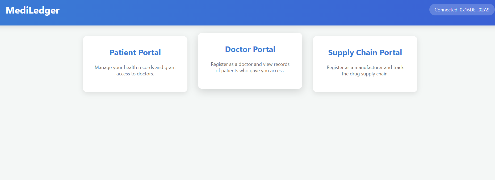
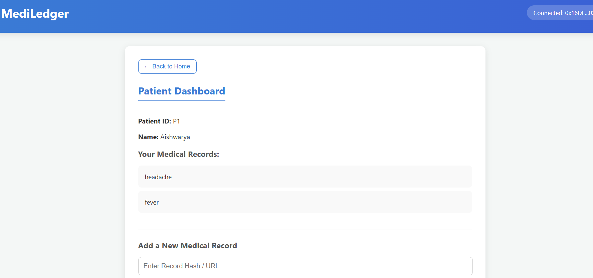
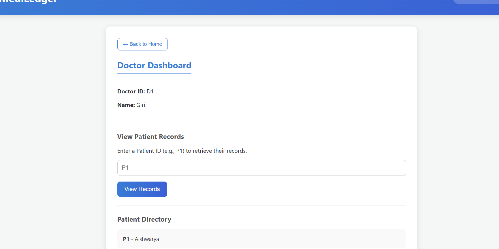
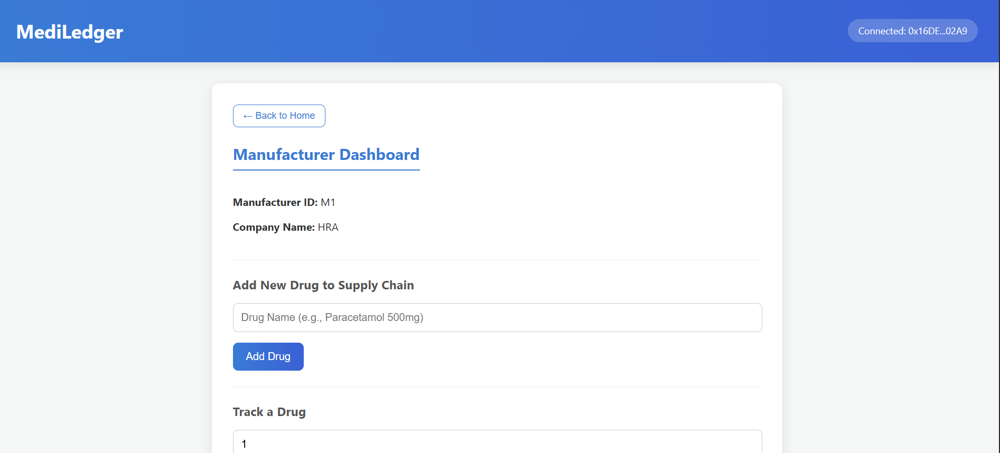
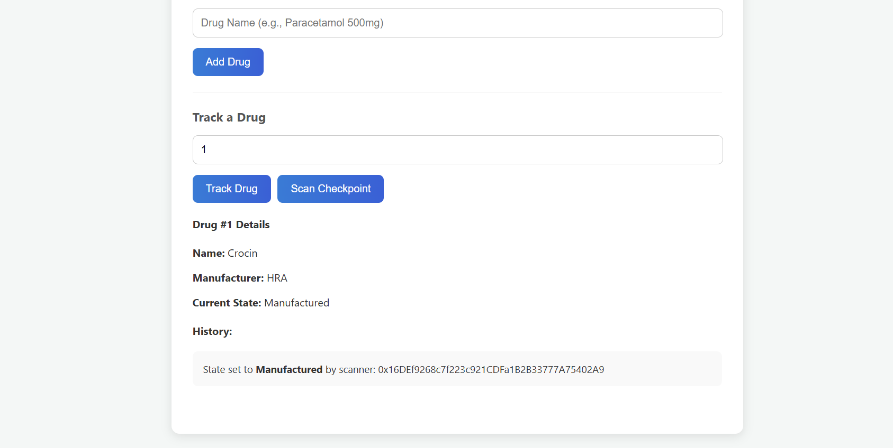

# 🏥 MediLedger - Your Health, Verified 


MediLedger is a **decentralized application (DApp)** built on the **Ethereum blockchain** that revolutionizes healthcare data management. It provides a **secure, transparent, and patient-centric** platform for managing **electronic health records (EHR)** and tracking the **pharmaceutical supply chain**, putting control back into the hands of users.  

---

## 🖼️ Application Preview  

MediLedger features a clean, modern, and multi-portal interface for different user roles, starting with a central dashboard.
  

### 👤 Patient Portal  
  

### 🩺 Doctor Portal  
  

### 💊 Supply Chain Portal  

 

---

## ✨ Core Features  

The platform is divided into **three distinct portals**, each with its own set of powerful features:  

### 👤 Patient Portal  
- **Decentralized Identity:** Register securely using an Ethereum wallet and receive a unique, user-friendly **Patient ID** (e.g., `P1`).  
- **Record Management:** Add and view your own **immutable medical records** on the blockchain.  
- **Access Control:** Grant specific, revocable access to your records to registered doctors using their **Doctor ID** (e.g., `D1`).  

### 🩺 Doctor Portal  
- **Professional Registration:** Register as a healthcare provider and receive a unique **Doctor ID** (e.g., `D1`).  
- **Patient Directory:** View a system-wide directory of all registered patients by their **ID and name**.  
- **Secure Record Viewing:** Access the medical records of only those patients who have explicitly **granted you permission**.  

### 💊 Drug Supply Chain Portal  
- **Manufacturer Registration:** Pharmaceutical companies can register and receive a unique **Manufacturer ID**.  
- **Drug Tokenization:** Add new drug batches to the blockchain, creating a **verifiable and immutable record** of their origin.  
- **Track and Trace:** Update a drug's status at various checkpoints (e.g., *"In-Transit"*, *"At Pharmacy"*), providing a **transparent and auditable trail** to combat counterfeiting.  

---

## 🛠️ Technology Stack  

- **Blockchain:** Solidity, Truffle Suite, Ganache  
- **Front-End:** React.js, Ethers.js, JavaScript (ES6+), CSS3  
- **Wallet & Authentication:** MetaMask  

---

## 📜 License  

This project is licensed under the terms of the [MIT License](./LICENSE).

---

## 🚀 Getting Started  

Follow these instructions to set up, deploy, and run the project on your local machine.  

### ✅ Prerequisites  

- [Node.js](https://nodejs.org/) (v14 or higher)  
- [Truffle Suite](https://trufflesuite.com/)  
  ```bash
  npm install -g truffle

---

### 🔧 Installation & Setup (The "Hard Reset" Method)  

This method ensures a **clean environment** and prevents synchronization errors.  

#### 1️⃣ Clone the Repository  
```bash
git clone https://github.com/AishRev/MediLedger--Your-Health-Verified.git
cd MediLedger--Your-Health-Verified

cd client
npm install

cd ..
truffle migrate --reset

cd client
npm start

Your browser will open to:
👉 http://localhost:3000
